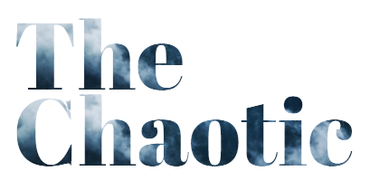
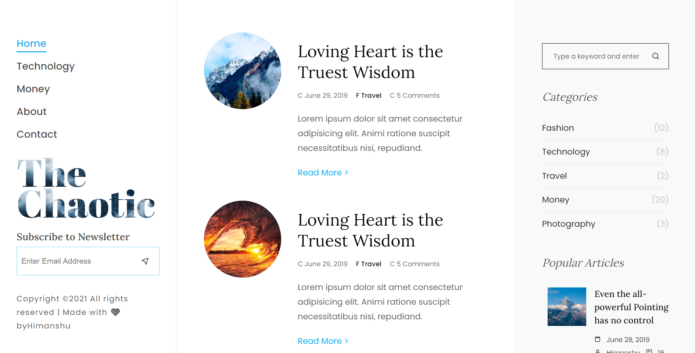
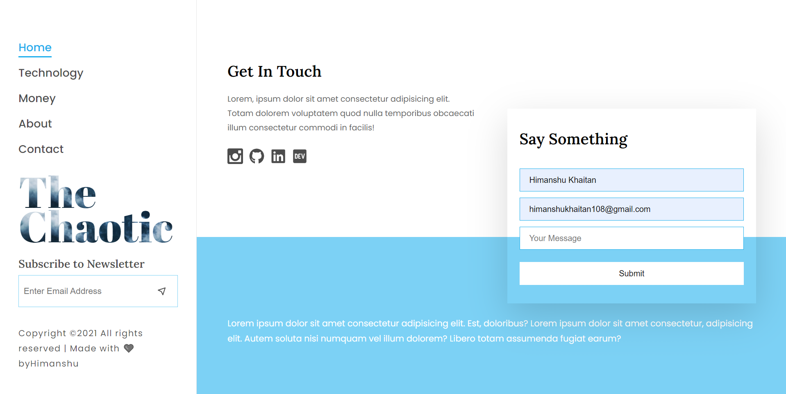
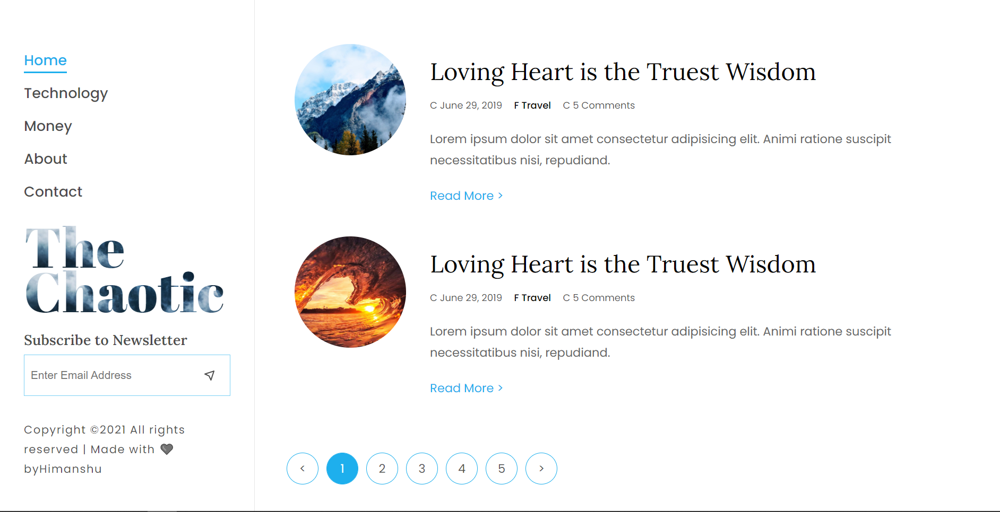
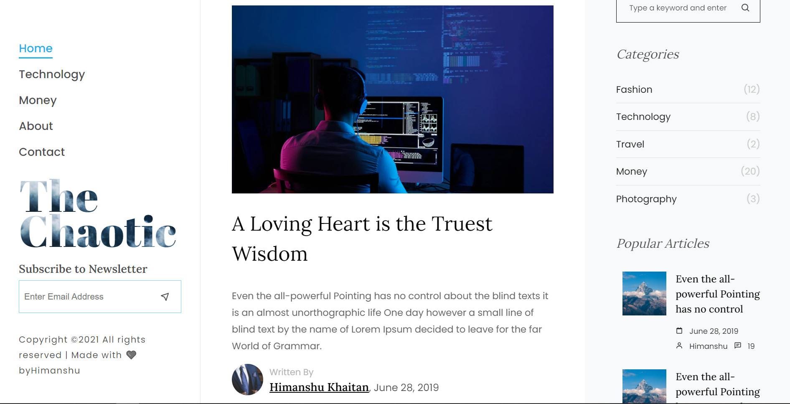

<h1 align="center">
   
  
     
  The Chaotic - Blog Website
   
</h1>

&nbsp;

&nbsp;

  &nbsp;

&nbsp;&nbsp;

<h4 align="center">A Personal Blog Website Setup using <a href="https://www.mongodb.com/mern-stack" target="_blank">MERN Stack</a>.</h4>

  
  
  
  

  <a href="#description">Description</a> •
  <a href="#screenshot">Screenshot</a> •
  <a href="#installation-and-setup">Installation and Setup</a> • <a href="#dependcies">Dependencies</a> •
  <a href="#license">License</a> • <a href="#contribution">Contribution</a>

## Description

## Screenshot
Below are some of the screenshots of UI from The Chaotic

### Home Page

### Contact Page

### Category Pages

### About Pages

## Installation and Setup

## Dependencies

## License
This project uses an [MIT](https://opensource.org/licenses/MIT) license.

## Contribution